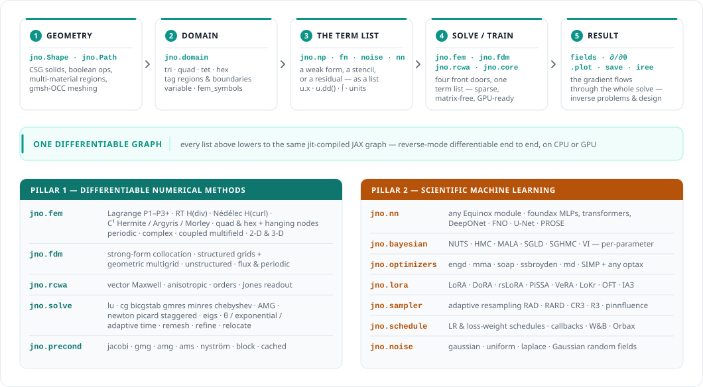

<p align="center">
  
</p>

<p align="center">
    <a href="https://fhg-iisb.github.io/jNO/">
        
    </a>
    <a href="LICENSE">
        
    </a>
    <a href="CITATION.cff">
        
    </a>
    
    <a href="https://arxiv.org/abs/2605.10159">
        
    </a>
</p>

**[Features](#what-you-can-do-with-jno)** · [Install](#install) · [Example](#example) · [Docs](https://fhg-iisb.github.io/jNO/) · [Citation](#citation)

**jNO** (jax Numerical Operators) is a JAX-native library for **differentiable
numerical methods**. Classical solvers — finite elements, finite differences,
and spectral (RCWA) — and scientific machine learning — PINNs, neural operators,
Bayesian inference — are two pillars on **one substrate**: you write the math
(a weak form, a strong-form stencil, a PDE residual, a data loss), and it lowers
to a single GPU-ready, end-to-end differentiable, `jit`-compiled graph.

Because every solve is differentiable, an inverse problem, a PDE-constrained
optimization and a neural-network coefficient are one composition away from a
forward solve — no glue code, no finite differences, no leaving JAX.

> [!NOTE]
> Research-level repository under active development. The public API is stabilising but may change between minor versions. Parts of the numerical-methods stack are marked *experimental* in the feature matrix below — the scope and known limitations are stated on each docs page.

## What you can do with jNO

<p align="center">
  <picture>
    <source media="(prefers-color-scheme: dark)" srcset="assets/overview-dark.svg">
    
  </picture>
</p>

Five stages, four front doors, one graph. Every module named above is public API; the matrix
below is the same map, with a maturity label and a docs page per feature.

<details>
<summary><strong>Feature matrix</strong> — maturity and per-feature docs (click to expand)</summary>

<br>

**Pillar 1 — differentiable numerical methods.** Every entry is matrix-free, GPU-ready and
differentiable end to end.

| | | |
|---|---|---|
| [**FEM**](https://fhg-iisb.github.io/jNO/fem/) · stable | [Elements](https://fhg-iisb.github.io/jNO/fem/elements/) · H(div)/H(curl)/C¹ experimental | [**FDM**](https://fhg-iisb.github.io/jNO/fdm/) · stable |
| [**RCWA**](https://fhg-iisb.github.io/jNO/rcwa/) · stable | [**PEEC**](https://fhg-iisb.github.io/jNO/peec/) · beta | [Solvers & preconditioners](https://fhg-iisb.github.io/jNO/solvers/) · stable |
| [Eigenproblems](https://fhg-iisb.github.io/jNO/API/#solvers-and-preconditioners) · beta | [Time integration](https://fhg-iisb.github.io/jNO/fdm/) · stable | [Adaptive meshing](https://fhg-iisb.github.io/jNO/fem/geometry/) · beta |
| [Domain decomposition](https://fhg-iisb.github.io/jNO/domain-decomposition/) · beta | [Geometry — `jno.Shape`](https://fhg-iisb.github.io/jNO/Domain-and-Geometry/) · stable | [Inverse & PDE-constrained](https://fhg-iisb.github.io/jNO/inverse-problems/) · stable |
| [Limits & build time](https://fhg-iisb.github.io/jNO/fem/limitations/) | | |

**Pillar 2 — scientific machine learning.** All stable, and all composable with any solve above.

| | | |
|---|---|---|
| [Forward PINNs](https://fhg-iisb.github.io/jNO/tutorials/01-basics/laplace-1d/) | [Variational PINNs](https://fhg-iisb.github.io/jNO/tutorials/08-fem-and-varpinns/poisson-2d-fem/) | [Operator learning](https://fhg-iisb.github.io/jNO/tutorials/11-operator-learning/) |
| [Bayesian PINNs](https://fhg-iisb.github.io/jNO/tutorials/10-bayesian-pinns/) | [Stochastic PDEs](https://fhg-iisb.github.io/jNO/tutorials/07-stochastic/fokker-planck-2d/) | [Adaptive resampling](https://fhg-iisb.github.io/jNO/adaptive/resampling/) |
| [LoRA & PEFT](https://fhg-iisb.github.io/jNO/model-controls/lora/) | [Explainability](https://fhg-iisb.github.io/jNO/tutorials/07-analysis/gradient-conflict/) | [Foundation models](https://fhg-iisb.github.io/jNO/foundation_models/) |
| [Parallelism](https://fhg-iisb.github.io/jNO/training/parallelism/) | [W&B + checkpointing](https://fhg-iisb.github.io/jNO/misc/wandb/) | [IREE deployment](https://fhg-iisb.github.io/jNO/model-controls/iree/) |

Architectures come from [foundax](https://github.com/FhG-IISB/foundax) — MLPs, transformers,
DeepONet, FNO, PROSE — wrapped with `jno.nn(...)`.

</details>

**35 worked tutorials** span elliptic, parabolic, hyperbolic, coupled, inverse, integral, stochastic,
FEM / variational, Bayesian and operator-learning problems — browse the
[tutorials index](https://fhg-iisb.github.io/jNO/#tutorials).

## Install

```bash
pip install jax-numerical-operators
```

One install — FEM, FDM, the solver stack, PINNs, and the scientific-ML tooling all come in the box, running on CPU out of the box. An NVIDIA GPU is one extra away — `pip install "jax-numerical-operators[cuda]"` — and the heavy, self-contained backends stay behind extras too: `[fem]` (adaptive remeshing + the PARDISO/cuDSS sparse-direct backends), `[rcwa]` (the Fourier-modal EM solver), `[amg]` (GPU algebraic multigrid), `[iree]`, combinable as `[cuda,fem]`. The [Installation guide](https://fhg-iisb.github.io/jNO/Installation/) has the full table, plus Pixi, Docker, and pinning a specific CUDA build.

PS: I recommend pulling the latest main branch to always be up to date!

## Example

<details open>
<summary><strong>Differentiable FEM & FDM — one term list, weak or strong form</strong></summary>

```python
import jno

d = jno.Shape.rect(0, 0, 1, 1, size=0.05).domain()
xi, yi, _ = d.variable("interior", split=True)
xb, yb, _ = d.variable("boundary", split=True)

# The same BVP two ways — −Δu = 1 on the unit square, u = 0 on the boundary.

# FEM — the WEAK form is the term list (with a test function v):
u, v = d.fem_symbols()
ui, vi = u.bind(x=xi, y=yi), v.bind(x=xi, y=yi)
u_fem = jno.fem([ui.x * vi.x + ui.y * vi.y - 1.0 * vi,   # ∫∇u·∇v − ∫f·v = 0
                 u(xb, yb) - 0.0]).solve()

# FDM — the STRONG form: the same term list, no test function, collocated at the nodes:
w  = d.unknown()
wi = w.bind(x=xi, y=yi)
u_fdm = jno.fdm([-wi.d2(xi) - wi.d2(yi) - 1.0,           # −Δu = 1
                 w(xb, yb) - 0.0]).solve()

# Both are sparse, matrix-free, GPU-ready, and end-to-end differentiable —
# wrap either in an objective to recover a coefficient, a source, or the geometry.
```

</details>

<details>
<summary><strong>Inverse — recover a coefficient by differentiating through the solve</strong> (click to expand)</summary>

```python
import jax.numpy as jnp
import optax
import jno

d = jno.Shape.rect(0, 0, 1, 1, size=0.2).domain()
xi, yi, _ = d.variable("interior", split=True)
xb, yb, _ = d.variable("boundary", split=True)
u, v = d.fem_symbols()
ui, vi = u.bind(x=xi, y=yi), v.bind(x=xi, y=yi)

# Name the bilinear and linear forms once, then write the weak form as it reads on paper.
a = lambda k, w, z: k * (w.x * z.x + w.y * z.y)      # ∫ k ∇u·∇v
L = lambda z: 1.0 * z                                 # ∫ f v
const = lambda c: (lambda *a, **kw: jnp.array([c]))

# Synthetic observations from the true coefficient.
k_true = jno.np.parameter((1,)).initialize(const(2.5)).freeze()
u_obs = jnp.asarray(jno.fem([a(k_true, ui, vi) - L(vi), u(xb, yb) - 0.0]).solve())

# The unknown coefficient — a trainable parameter sitting inside the weak form.
k = jno.np.parameter((1,), name="k").initialize(const(1.0))
k.optimizer(optax.adam(5e-2))

fem  = jno.fem([a(k, ui, vi) - L(vi), u(xb, yb) - 0.0])
crux = jno.core([(fem.solve() - u_obs).mse], domain=d)   # the solve IS the forward model
crux.solve(400)                                          # k → 2.4999  (truth 2.5)
```

No adjoint derived, no finite differences, no second implementation of the physics — the gradient
flows back through the assembly and the linear solve. Swap `k` for a spatially varying field, for the
mesh coordinates, or for `jno.nn(net)` and nothing about the structure changes.

</details>

<details>
<summary><strong>Coupled multiphysics — Rayleigh–Bénard convection in one term list</strong> (click to expand)</summary>

```python
import jax
jax.config.update("jax_enable_x64", True)          # the assembler builds in float64

import numpy as np
import jno

Pr, Ra = 1.0, 1.0e4                                 # Ra >> Ra_c ≈ 1708 → vigorous convection
Lx, Ly, dt, nsteps = 2.0, 1.0, 0.009, 26

d = jno.Shape.rect(0, 0, Lx, Ly, size=0.11).domain(time=(0.0, nsteps * dt, nsteps + 1))
u, v = d.fem_symbols(value_shape=(2,), names=("u", "v"), order=2)   # P2 velocity  ┐ inf-sup
p, q = d.fem_symbols(names=("p", "q"), order=1)                     # P1 pressure  ┘ stable pair
T, s = d.fem_symbols(names=("T", "sT"), order=1)                    # P1 temperature
xi, yi, ti = d.variable("interior", split=True)
xb, yb, _  = d.variable("boundary", split=True)
ci = d.variable("initial", split=True)
ub, vb = u.bind(x=xi, y=yi, t=ti), v.bind(x=xi, y=yi, t=ti)
pb, qb = p.bind(x=xi, y=yi, t=ti), q.bind(x=xi, y=yi, t=ti)
Tb, sb = T.bind(x=xi, y=yi, t=ti), s.bind(x=xi, y=yi, t=ti)

ux, uy, vx, vy = ub[0], ub[1], vb[0], vb[1]
uxx, uxy, uyx, uyy = ub.x[0], ub.y[0], ub.x[1], ub.y[1]             # grad-then-index: ∂uᵢ/∂xⱼ
vxx, vxy, vyx, vyy = vb.x[0], vb.y[0], vb.x[1], vb.y[1]

momentum = ((ub.t[0] * vx + ub.t[1] * vy)                           # ∂u/∂t
            + ((ux * uxx + uy * uxy) * vx + (ux * uyx + uy * uyy) * vy)   # (u·∇)u  — nonlinear
            + Pr * (uxx * vxx + uxy * vxy + uyx * vyx + uyy * vyy)  # Pr ∇u : ∇v
            - pb * (vxx + vyy)                                      # −p ∇·v
            - Pr * Ra * Tb * vy)                                    # buoyancy:  T → momentum
continuity = qb * (uxx + uyy)                                       # ∇·u = 0
energy = Tb.t * sb + (ux * Tb.x + uy * Tb.y) * sb + (Tb.x * sb.x + Tb.y * sb.y)   # u → T

Tcond = 1.0 - ci[1] / Ly                                            # hot floor, cold lid
T0 = Tcond + 0.05 * jno.np.sin(2 * np.pi * ci[0] / Lx) * jno.np.sin(np.pi * ci[1] / Ly)

fem = jno.fem([momentum, continuity, energy,
               u(xb, yb) - 0.0,                     # no-slip walls
               T(xb, yb) - (1.0 - yb / Ly),         # conductive profile held on the walls
               p.pin(),                             # gauge-fix the pressure null space
               u(*ci) - 0.0, T(*ci) - T0])          # start at rest, seeded

assert fem.is_transient and not fem.is_linear       # both DETECTED from the terms, not configured

sol  = fem.solve(linear=jno.solve.lu())             # a saddle system: name a direct solver
traj = np.asarray(jno.core([sol.mse]).eval([sol]))  # (27, 2398) — one row per step
uu, pp, TT = (traj[:, a:b] for a, b in zip(fem.offsets[:-1], fem.offsets[1:]))
# T range 0.000..1.000   peak |u| 27.7   — started at rest, ended in counter-rotating rolls
```

Three fields, coupled **both ways**: buoyancy `Pr·Ra·T` drives the momentum balance, and `u·∇T`
carries the flow back into the energy balance — a product of two *different* unknowns, so the system
is nonlinear. Nothing above selects a mode: `fem.solve()` reads `u.t` and the nonlinearity off the
term list and marches backward-Euler with Newton per step.

</details>

<details>
<summary><strong>RCWA — a periodic metasurface, from the same constraint list</strong> (click to expand)</summary>

```python
import jno
import jax.numpy as jnp

# A periodic metasurface unit cell — a patterned high-index slab between two ambients.
K0 = 2 * jnp.pi                                            # vacuum wavenumber (wavelength λ = 1)
d = jno.Shape.box(0, 0, 0, 0.6, 0.6, 1.0, size=0.12).domain()
d.tag("bottom", lambda x, y, z: z < 0.01);  d.tag("top",   lambda x, y, z: z > 0.99)   # z ambients
d.tag("left",   lambda x, y, z: x < 0.01);  d.tag("right", lambda x, y, z: x > 0.59)   # x-periodic
d.tag("front",  lambda x, y, z: y < 0.01);  d.tag("back",  lambda x, y, z: y > 0.59)   # y-periodic

u, v = d.fem_symbols()
xi, yi, zi, _ = d.variable("interior", split=True)
ui, vi = u.bind(x=xi, y=yi, z=zi), v.bind(x=xi, y=yi, z=zi)
def on(tag):                                              # bind u, v on a named face
    s = d.variable(tag, split=True)
    return u.bind(x=s[0], y=s[1], z=s[2]), v.bind(x=s[0], y=s[1], z=s[2])
(ut, vt), (ub, vb) = on("top"), on("bottom")
ul, ur, uf, ubk = on("left")[0], on("right")[0], on("front")[0], on("back")[0]

slab = jno.fn(lambda x, y, z: jnp.where((0.4 < z) & (z < 0.6), 1.0, 0.0), [xi, yi, zi])
eps  = 1.0 + 10.0 * slab      # a patterned slab (swap in jno.np.parameter(...) for inverse design)

# the SAME scalar-Helmholtz list you'd hand jno.fem — rcwa infers period, layers, ε, and incidence:
sol = jno.rcwa([
    ui.x * vi.x + ui.y * vi.y + ui.z * vi.z - K0**2 * eps * (u * vi),   # ∇u·∇v − k₀²·ε·u·v
    -(1j * K0 * ut) * vt,                   # outgoing radiation (top ambient)
    -(1j * K0 * ub - 2j * K0) * vb,         # incident plane wave + radiation (bottom)
    ul - ur,  uf - ubk,                     # Floquet periodicity (x and y)
], orders=200).solve()

sol.efficiency("T")     # transmitted power fraction (needs the [rcwa] backend)
sol.order(+1, 0)        # a chosen diffraction order
```

</details>

<details>
<summary><strong>Operator learning — an FNO trained on the PDE residual, with no labelled solutions</strong> (click to expand)</summary>

```python
import jno
import jax
import optax
import foundax

# `diff_type` declares the differentiation for the whole run. Spectral differentiates the operator's
# OUTPUT along its own grid axes, so the residual needs no autodiff path from x — which is what makes
# a physics loss writable on a field-to-field operator.
dir = jno.setup("./runs/pino", diff_type="spectral")

# Solve −Δu = f on the periodic unit square, for a whole DISTRIBUTION of forcings f at once.
N = 64
dom = 256 * jno.Shape.rect(0, 0, 1, 1, size=1 / N).domain(structured=True)
x, y, _ = dom.variable("interior", split=True)

# The input function: a fresh Gaussian random field per batch — an operator dataset without a dataset.
# (Swap in your own: `f = dom.variable("_f", forcing)` with forcing shaped (samples, H, W, 1),
#  eagerly or as a lazy h5py/zarr handle that streams per batch.)
f = jno.noise.grf(x, y, length_scale=0.2)

grid = (N + 1, N + 1)              # `size=1/N` spans the interval inclusive of both endpoints
net = jno.nn(foundax.fno2d(in_features=1, hidden_channels=32, n_modes=16, d_model=grid))
net.optimizer(optax.adam(1e-3))

u = net(f).bind(x=x, y=y)          # the operator's output, bound to the grid coordinates
pde = u.xx + u.yy + f              # Δu + f = 0 — the two partials fuse into ONE transform pair

crux = jno.core(constraints=[pde.mse], domain=dom)
crux.solve(epochs=20_000, batchsize=8).plot(f"{dir}/training.png")
```

</details>

## Citation

If you use jNO in academic work, please cite:

```bibtex
@article{armbruster2026jno,
  title   = {jNO: A JAX Library for Neural Operator and Foundation Model Training},
  author  = {Armbruster, Leon and Ramesh, Rathan and Kruse, Georg and Straub, Christopher},
  journal = {arXiv preprint arXiv:2605.10159},
  year    = {2026},
  doi     = {10.48550/arXiv.2605.10159},
  url     = {https://arxiv.org/abs/2605.10159}
}
```

## AI Disclosure

Parts of this codebase — including model ports, tests, and documentation — were developed with the assistance of AI coding tools. All contributions are reviewed and tested to the best of our ability, but mistakes may remain; please open an issue if you spot one.
