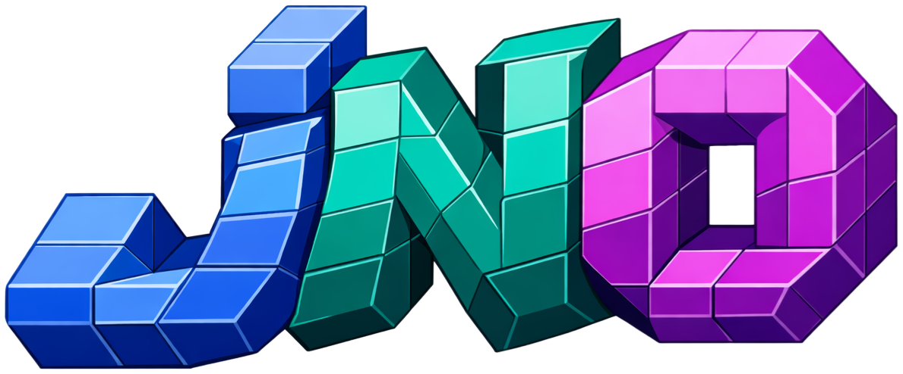

<p align="center">
  
</p>

<p align="center">
    <a href="https://fhg-iisb.github.io/jNO/">
        
    </a>
    <a href="https://github.com/FhG-IISB/jno/actions/workflows/ci.yml">
        
    </a>
    <a href="https://codecov.io/gh/FhG-IISB/jno">
        
    </a>
    <a href="LICENSE">
        
    </a>
    <a href="CITATION.cff">
        
    </a>
    
    <a href="https://arxiv.org/abs/2605.10159">
        
    </a>
</p>

**[Features](#what-you-can-do-with-jno)** · [Install](#install) · [Example](#example) · [Docs](https://fhg-iisb.github.io/jNO/) · [Citation](#citation)

**jNO** (jax Neural Operators) is a JAX-native library for training neural
operators and physics-informed networks. It unifies data-driven operator
regression, residual-based PINN training, mesh-aware FEM/variational
PINNs, and foundation-model fine-tuning under one symbolic tracing
language — write the PDE once, compile once, train, evaluate, and
checkpoint without rewriting the surrounding code.

> [!NOTE]
> Research-level repository under active development. The public API is stabilising but may change between minor versions.

## What you can do with jNO

| Capability | Status | Notes |
|------------|--------|-------|
| Forward PINNs (residual minimisation) | [stable](docs/tutorials/01-basics/poisson-1d.md) | Hard or soft BC enforcement |
| Operator learning (DeepONet, FNO, PROSE via [foundax](https://github.com/FhG-IISB/foundax)) | [stable](docs/Getting-Started.md) | Combine with PDE residual or train purely data-driven |
| Inverse problems (parameter recovery, surrogate inversion) | [stable](docs/tutorials/05-coupled-and-inverse/inverse-parameter.md) | |
| FEM / Variational PINNs | [stable](docs/tutorials/08-fem-and-varpinns/poisson-2d-fem.md) | TRI3 / TRI6 / QUAD4 elements, weak-form assembly |
| Adaptive resampling (RAD, RARD, CR3, R3, pinnfluence) | [stable](docs/adaptive/resampling.md) | |
| Stochastic PDEs and noise nodes (gaussian / uniform / laplace) | [stable](docs/tutorials/07-stochastic/fokker-planck-2d.md) | Fokker–Planck, stochastic forcing |
| Bayesian PINNs (NUTS, HMC, MALA, SGLD, SGHMC, VI) | [stable](docs/tutorials/10-bayesian-pinns/index.md) | 14 worked tutorials |
| Parameter-efficient fine-tuning (LoRA, DoRA, rsLoRA, PiSSA, VeRA, LoKr, OFT, IA3) | [stable](docs/model-controls/lora.md) | Chain `.lora(...)` on any wrapped model |
| Training explainability (gradient conflict, NTK, Hessian, loss landscape, input sensitivity, residual stats) | [stable](docs/tutorials/07-analysis/gradient-conflict.md) | |
| Foundation-model integration ([foundax](https://github.com/FhG-IISB/foundax) MLPs, transformers, DeepONet, FNO, PROSE) | [stable](docs/foundation_models/index.md) | Wrap any Equinox module via `jno.nn.wrap(...)` |
| Hybrid data + model parallelism | [stable](docs/training/parallelism.md) | `jno.core(..., mesh=(batch, model))` |
| W&B logging + Orbax checkpointing | [stable](docs/tutorials/09-wandb/wandb-integration.md) | |
| IREE / MLIR compiled inference for deployment | [stable](docs/model-controls/iree.md) | |
| Hyperparameter / architecture search | [beta](docs/Hyperparameter-Tuning.md) | Grid + Nevergrad |
| Multi-physics coupling | [beta](docs/tutorials/05-coupled-and-inverse/hyco-poisson-1d.md) | HyCo patterns developing |

~50 worked tutorials across elliptic, parabolic, hyperbolic, coupled, inverse, integral, stochastic, FEM/variational, and Bayesian groups — see [`docs/tutorials/`](docs/tutorials/).

## Install

```bash
pip install "jax-neural-operators[fem]"
```

GPU support is included by default (jNO depends on `jax[cuda]`). See
[`docs/Installation.md`](docs/Installation.md) for Pixi, Docker, and
specific-CUDA-version setups.

Foundation models and other neural operator architectures live in a
separate repository ([foundax](https://github.com/FhG-IISB/foundax)),
installed automatically as a dependency so they can also be used on
their own.

## Example

<details>
<summary><strong>2-D Poisson with DeepONet — full end-to-end script</strong> (click to expand)</summary>

```python
import jno
import jax
import optax
import foundax

dir = jno.setup("./runs/test")

# Domain
dom = 500 * jno.domain.rect(mesh_size=0.05, x_range=(0, 2), y_range=(0, 1))
x, y, _ = dom.variable("interior")
xb, yb, _ = dom.variable("boundary")

random_k = jax.random.uniform(jax.random.PRNGKey(0), shape=(500, 1, 1), minval=0.5, maxval=1.5)
k = dom.variable("k", random_k)

# Neural Network
fx = foundax.deeponet(n_sensors=1, coord_dim=2, basis_functions=32, hidden_dim=128, activation=jax.numpy.tanh)
net = jno.nn.wrap(fx)
net.optimizer(optax.adam(learning_rate=optax.schedules.cosine_decay_schedule(init_value=1e-3, decay_steps=20_000, alpha=1e-5)))

# Forward pass and hard enforcement of BCs via output transformation
u = net(k, jno.np.concat([x, y], axis=-1)) * x * (2 - x) * y * (1 - y)
pde = k * (u.dd(x) + u.dd(y)) + 1.0  # PDE Loss

# Checkpointing (saves every 5000 epochs, keeps best 3)
cb = jno.callbacks.checkpoint(save_interval_epochs=5000, best_fn=lambda m: m["total_loss"])

# Create -> Train -> Save
crux = jno.core(constraints=[pde.mse], domain=dom).print_shapes()
crux.solve(epochs=20_000, batchsize=32, callbacks=[cb]).plot(f"{dir}/training.png")
jno.save(crux, f"{dir}/model.pkl")

# Inference via test domain on a finer mesh
tst_dom = 16 * jno.domain.rect(mesh_size=0.01, x_range=(0, 2), y_range=(0, 1))
tst_dom.variable("k", jax.random.uniform(jax.random.PRNGKey(0), shape=(16, 1, 1), minval=0.1, maxval=1.9))

pred, x, y, k = crux.eval([u, x, y, k], domain=tst_dom)
print(pred.shape, x.shape, y.shape, k.shape)
```

</details>

## Citation

If you use jNO in academic work, please cite:

```bibtex
@article{armbruster2026jno,
  title   = {jNO: A JAX Library for Neural Operator and Foundation Model Training},
  author  = {Armbruster, Leon and Ramesh, Rathan and Kruse, Georg and Straub, Christopher},
  journal = {arXiv preprint arXiv:2605.10159},
  year    = {2026},
  doi     = {10.48550/arXiv.2605.10159},
  url     = {https://arxiv.org/abs/2605.10159}
}
```

## AI Disclosure

Parts of this codebase — including model ports, tests, and documentation — were developed with the assistance of AI coding tools. All contributions are reviewed and tested to the best of our ability, but mistakes may remain; please open an issue if you spot one.
