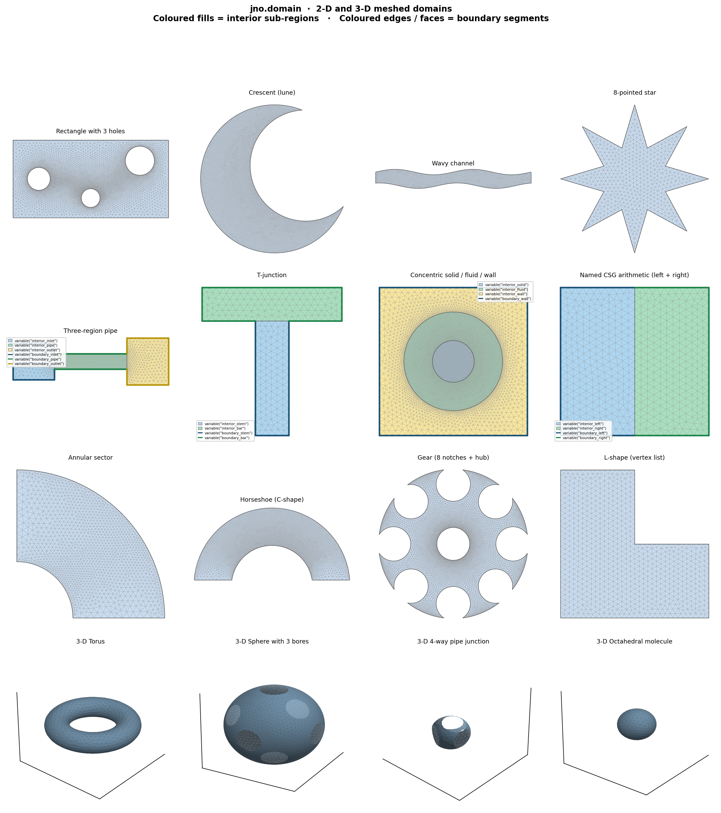

# Domain & Geometry

The `jno.domain` class manages mesh generation, physical group labelling, and sampling of collocation points. It wraps [pygmsh](https://github.com/nschloe/pygmsh) for mesh generation and [meshio](https://github.com/nschloe/meshio) for I/O.

---

## Domain Gallery

16 meshed domains illustrating the full range of `jno.domain` construction paths — 12 two-dimensional and 4 three-dimensional. Coloured fills show interior sub-regions (`variable("interior_<name>")`); coloured edges/faces show boundary segments (`variable("boundary_<name>")`).



=== "1 · Rectangle with 3 holes"

    ```python
    from shapely.geometry import box, Point
    geo = box(0, 0, 3, 1.5)
    geo = geo.difference(Point(0.5, 0.75).buffer(0.22))
    geo = geo.difference(Point(1.5, 0.38).buffer(0.18))
    geo = geo.difference(Point(2.45, 1.1).buffer(0.28))
    dom = jno.domain(geo).build_mesh(0.07)
    x, y = dom.variable("interior")
    xb, yb = dom.variable("boundary")
    ```

=== "2 · Crescent (lune)"

    ```python
    from shapely.geometry import Point
    big   = Point(0, 0).buffer(1.0, resolution=80)
    small = Point(0.42, 0.18).buffer(0.75, resolution=80)
    dom = jno.domain(big.difference(small)).build_mesh(0.05)
    ```

=== "3 · Wavy channel"

    ```python
    import numpy as np
    from shapely.geometry import Polygon
    x = np.linspace(0, 4 * np.pi, 120)
    top = list(zip(x,        0.55 + 0.22 * np.sin(x)))
    bot = list(zip(x[::-1], -0.55 + 0.22 * np.sin(x[::-1] + np.pi / 2.5)))
    dom = jno.domain(Polygon(top + bot), mesh_size=0.12)
    ```

=== "4 · 8-pointed star"

    ```python
    import numpy as np
    from shapely.geometry import Polygon
    n = 8
    angles = np.linspace(0, 2 * np.pi, 2 * n, endpoint=False)
    radii  = [1.0 if i % 2 == 0 else 0.45 for i in range(2 * n)]
    pts    = [(r * np.cos(a), r * np.sin(a)) for r, a in zip(radii, angles)]
    dom = jno.domain(Polygon(pts)).build_mesh(0.06)
    ```

=== "5 · Three-region pipe"

    ```python
    from shapely.geometry import box
    dom = jno.domain({
        "inlet":  box(0.0, 0.15, 0.8, 0.85),
        "pipe":   box(0.8, 0.35, 2.2, 0.65),
        "outlet": box(2.2, 0.05, 3.0, 0.95),
    }).build_mesh(0.08, sizes={"pipe": 0.025})
    x_in, y_in = dom.variable("interior_inlet")
    x_p,  y_p  = dom.variable("interior_pipe")
    x_out,y_out = dom.variable("interior_outlet")
    xb_in, yb_in = dom.variable("boundary_inlet")    # inlet face
    xb_out,yb_out = dom.variable("boundary_outlet")  # outlet face
    ```

=== "6 · T-junction"

    ```python
    from shapely.geometry import box
    dom = jno.domain({
        "stem": box(0.38, 0.00, 0.62, 0.82),
        "bar":  box(0.00, 0.82, 1.00, 1.06),
    }).build_mesh(0.05)
    x_stem, y_stem = dom.variable("interior_stem")
    x_bar,  y_bar  = dom.variable("interior_bar")
    ```

=== "7 · Concentric solid / fluid / wall"

    ```python
    from shapely.geometry import box, Point
    solid = Point(0, 0).buffer(0.22, resolution=40)
    fluid = Point(0, 0).buffer(0.52, resolution=64).difference(solid)
    wall  = box(-0.78, -0.78, 0.78, 0.78).difference(
                Point(0, 0).buffer(0.52, resolution=64))
    dom = jno.domain(
        {"solid": solid, "fluid": fluid, "wall": wall}
    ).build_mesh(0.07, sizes={"solid": 0.015, "fluid": 0.025})
    x_s, y_s = dom.variable("interior_solid")
    x_f, y_f = dom.variable("interior_fluid")
    x_w, y_w = dom.variable("interior_wall")
    xb, yb   = dom.variable("boundary_wall")   # outer square boundary
    ```

=== "8 · Named CSG arithmetic"

    ```python
    from shapely.geometry import box
    left  = jno.domain(box(0, 0, 0.5, 1), name="left")
    right = jno.domain(box(0.5, 0, 1, 1), name="right")
    dom   = (left + right).build_mesh(0.05)
    x_l, y_l = dom.variable("interior_left")
    x_r, y_r = dom.variable("interior_right")
    xb_l, yb_l = dom.variable("boundary_left")
    xb_r, yb_r = dom.variable("boundary_right")
    ```

=== "9 · Annular sector"

    ```python
    from shapely.geometry import box, Point
    first_q = box(0, 0, 1.05, 1.05)
    sector  = Point(0, 0).buffer(1.0, resolution=80).intersection(first_q)
    inner   = Point(0, 0).buffer(0.38, resolution=40)
    dom = jno.domain(sector.difference(inner)).build_mesh(0.05)
    ```

=== "10 · Horseshoe (C-shape)"

    ```python
    from shapely.geometry import box, Point
    outer = Point(0, 0).buffer(1.0, resolution=80)
    inner = Point(0, 0).buffer(0.52, resolution=80)
    clip  = box(-1.1, -1.1, 1.1, 0.08)
    dom = jno.domain(outer.difference(inner).difference(clip)).build_mesh(0.05)
    ```

=== "11 · Gear (8 notches + hub)"

    ```python
    import numpy as np
    from shapely.geometry import Point
    gear = Point(0, 0).buffer(1.0, resolution=128)
    for i in range(8):
        a = 2 * np.pi * i / 8
        gear = gear.difference(
            Point(np.cos(a) * 0.80, np.sin(a) * 0.80).buffer(0.23, resolution=12))
    gear = gear.difference(Point(0, 0).buffer(0.22, resolution=48))
    dom = jno.domain(gear).build_mesh(0.05)
    ```

=== "12 · L-shape (vertex list)"

    ```python
    dom = jno.domain(
        [[0,0],[2,0],[2,1],[1,1],[1,2],[0,2]]
    ).build_mesh(0.07)
    x, y = dom.variable("interior")
    xb, yb, nx, ny = dom.variable("boundary", normals=True)
    ```

=== "13 · 3-D Torus"

    ```python
    import gmsh, meshio, os, tempfile

    def constructor(geo):
        # geo is a pygmsh.geo.Geometry — gmsh is already initialised.
        # We use the OCC kernel directly and return a meshio.Mesh so that
        # jno bypasses geo.generate_mesh() entirely.
        gmsh.option.setNumber("Mesh.CharacteristicLengthMax", 0.12)
        gmsh.model.occ.addTorus(0, 0, 0, 1.0, 0.35)   # major r=1.0, tube r=0.35
        gmsh.model.occ.synchronize()
        vols  = [t for _, t in gmsh.model.getEntities(3)]
        surfs = [t for _, t in gmsh.model.getEntities(2)]
        gmsh.model.addPhysicalGroup(3, vols, name="interior")
        gmsh.model.addPhysicalGroup(2, surfs, name="boundary")
        gmsh.model.mesh.generate(3)
        with tempfile.NamedTemporaryFile(suffix=".msh", delete=False) as f:
            fname = f.name
        gmsh.write(fname)
        mesh = meshio.read(fname); os.unlink(fname)
        return mesh, 3, 0.12

    dom = jno.domain(constructor=constructor)
    x, y, z = dom.variable("interior")
    xb, yb, zb = dom.variable("boundary")
    ```

=== "14 · 3-D Sphere with 3 bores"

    ```python
    import gmsh, meshio, os, tempfile

    def constructor(geo):
        gmsh.option.setNumber("Mesh.CharacteristicLengthMax", 0.09)
        s = gmsh.model.occ.addSphere(0, 0, 0, 1.0)
        cuts = []
        for dx, dy, dz in [(2.2, 0, 0), (0, 2.2, 0), (0, 0, 2.2)]:
            cuts.append((3, gmsh.model.occ.addCylinder(
                -dx/2, -dy/2, -dz/2, dx, dy, dz, 0.28)))
        gmsh.model.occ.cut([(3, s)], cuts)
        gmsh.model.occ.synchronize()
        vols  = [t for _, t in gmsh.model.getEntities(3)]
        surfs = [t for _, t in gmsh.model.getEntities(2)]
        gmsh.model.addPhysicalGroup(3, vols, name="interior")
        gmsh.model.addPhysicalGroup(2, surfs, name="boundary")
        gmsh.model.mesh.generate(3)
        with tempfile.NamedTemporaryFile(suffix=".msh", delete=False) as f:
            fname = f.name
        gmsh.write(fname)
        mesh = meshio.read(fname); os.unlink(fname)
        return mesh, 3, 0.09

    dom = jno.domain(constructor=constructor)
    x, y, z = dom.variable("interior")
    xb, yb, zb = dom.variable("boundary")
    ```

=== "15 · 3-D 4-way pipe junction"

    ```python
    import gmsh, meshio, numpy as np, os, tempfile

    def constructor(geo):
        gmsh.option.setNumber("Mesh.CharacteristicLengthMax", 0.09)
        s = gmsh.model.occ.addSphere(0, 0, 0, 0.38)
        pieces = [(3, s)]
        for i in range(3):                        # 3 horizontal arms at 120°
            angle = 2 * np.pi * i / 3
            dx, dy = 0.90 * np.cos(angle), 0.90 * np.sin(angle)
            pieces.append((3, gmsh.model.occ.addCylinder(0, 0, 0, dx, dy, 0, 0.24)))
        pieces.append((3, gmsh.model.occ.addCylinder(0, 0, 0, 0, 0, 1.0, 0.24)))
        gmsh.model.occ.fuse([pieces[0]], pieces[1:])
        gmsh.model.occ.synchronize()
        vols  = [t for _, t in gmsh.model.getEntities(3)]
        surfs = [t for _, t in gmsh.model.getEntities(2)]
        gmsh.model.addPhysicalGroup(3, vols, name="interior")
        gmsh.model.addPhysicalGroup(2, surfs, name="boundary")
        gmsh.model.mesh.generate(3)
        with tempfile.NamedTemporaryFile(suffix=".msh", delete=False) as f:
            fname = f.name
        gmsh.write(fname)
        mesh = meshio.read(fname); os.unlink(fname)
        return mesh, 3, 0.09

    dom = jno.domain(constructor=constructor)
    x, y, z = dom.variable("interior")
    xb, yb, zb = dom.variable("boundary")
    ```

=== "16 · 3-D Octahedral molecule"

    ```python
    import gmsh, meshio, os, tempfile

    def constructor(geo):
        gmsh.option.setNumber("Mesh.CharacteristicLengthMax", 0.10)
        s0 = gmsh.model.occ.addSphere(0, 0, 0, 0.42)
        pieces = [(3, s0)]
        for pos in [(0.75,0,0),(-0.75,0,0),(0,0.75,0),(0,-0.75,0),(0,0,0.75),(0,0,-0.75)]:
            pieces.append((3, gmsh.model.occ.addSphere(*pos, 0.28)))
        gmsh.model.occ.fuse([pieces[0]], pieces[1:])
        gmsh.model.occ.synchronize()
        vols  = [t for _, t in gmsh.model.getEntities(3)]
        surfs = [t for _, t in gmsh.model.getEntities(2)]
        gmsh.model.addPhysicalGroup(3, vols, name="interior")
        gmsh.model.addPhysicalGroup(2, surfs, name="boundary")
        gmsh.model.mesh.generate(3)
        with tempfile.NamedTemporaryFile(suffix=".msh", delete=False) as f:
            fname = f.name
        gmsh.write(fname)
        mesh = meshio.read(fname); os.unlink(fname)
        return mesh, 3, 0.10

    dom = jno.domain(constructor=constructor)
    x, y, z = dom.variable("interior")
    xb, yb, zb = dom.variable("boundary")
    ```

---

## Constructing a domain

For **2-D problems**, the recommended path is `jno.domain(geo)` — define your geometry with [shapely](https://shapely.readthedocs.io/) CSG arithmetic, call `.build_mesh()`, and you have a fully meshed domain that supports `.integrate()` and FD derivatives. For **3-D geometry**, PML absorbing layers, or cases that need raw gmsh control, use a [built-in named constructor](#2-built-in-named-constructors) or a [custom constructor](#3-custom-constructor-advanced-3-d) instead.

### 1. `jno.domain` — shapely → gmsh (2-D, recommended)

#### Basic usage

Pass any shapely geometry as the first argument. Two auto-generated tags are always available: `"interior"` (all interior points) and `"boundary"` (the outer boundary):

```python
import jno
from shapely.geometry import box, Point

geo = box(0, 0, 2, 1).difference(Point(1, 0.5).buffer(0.3))
dom = jno.domain(geo).mesh(0.05)

x, y   = dom.variable("interior")
xb, yb, nx, ny = dom.variable("boundary", normals=True)
```

For a simple polygon, pass a vertex list directly — no shapely import needed:

```python
dom = jno.domain([[0,0],[1,0],[1,0.5],[0.5,1],[0,1]]).mesh(0.05)
```

Add `mesh_size=` for a one-liner when no per-region refinement is needed:

```python
dom = jno.domain(geo, mesh_size=0.05)
```

#### CSG arithmetic and named regions

When you construct each piece as a named region, jno tracks the names through arithmetic. That lets you sample sub-regions by name and refine each independently at mesh time — which is not possible if you compose everything in shapely first and pass a single anonymous geometry.

Pass a `dict` of named regions directly, or use `name=` when building a single piece:

```python
from shapely.geometry import box, Point

fluid_geo = box(0, 0, 1, 1).difference(Point(0.5, 0.5).buffer(0.2))
solid_geo = Point(0.5, 0.5).buffer(0.2)

dom = jno.domain({
    "fluid": fluid_geo,
    "solid": solid_geo,
}).build_mesh(0.08, sizes={"solid": 0.01})

x_f, y_f = dom.variable("interior_fluid")      # fluid sub-region only
x_s, y_s = dom.variable("interior_solid")      # solid sub-region only
xb, yb   = dom.variable("boundary_solid")      # fluid-solid interface
```

You can also apply CSG operators directly on `jno.domain` instances — the source-region registry is merged and preserved on every operation:

| Operator | Method | Effect |
|---|---|---|
| `a + b` or `a \| b` | `.union(b)` | union |
| `a - b` | `.difference(b)` | A minus B |
| `a & b` | `.intersection(b)` | overlap only |
| `a ^ b` | `.symmetric_difference(b)` | XOR |

```python
left  = jno.domain(box(0, 0, 0.5, 1), name="left")
right = jno.domain(box(0.5, 0, 1, 1), name="right")

dom = (left + right).build_mesh(0.05)
x_l, y_l = dom.variable("interior_left")
x_r, y_r = dom.variable("interior_right")
```

Auto-generated tags for a domain with named regions:

| Tag | Contents |
|---|---|
| `"interior"` | all interior points |
| `"boundary"` | full outer boundary |
| `"interior_<name>"` | interior of the named sub-region |
| `"boundary_<name>"` | edges of the named sub-region |

For explicit BC surfaces (e.g. an inlet face that is a subset of a boundary), use `.add_boundary_segments(tag, segments)` to register a named edge set.

`build_mesh` accepts `sizes={"name": h}` as a short spelling of `region_mesh_sizes=`.

#### Custom samplers (mesh-free path only)

When `build_mesh()` is **not** called, interior points are drawn by uniform rejection sampling inside each polygon. Pass a callable to override this per region or globally. The sampler signature is `fn(geometry, n) -> np.ndarray` with shape `(n, 2)`.

```python
import numpy as np
from shapely.geometry import box

def grid_sampler(geometry, n):
    """Uniform grid instead of random points."""
    minx, miny, maxx, maxy = geometry.bounds
    side = int(np.ceil(np.sqrt(n)))
    xs = np.linspace(minx, maxx, side)
    ys = np.linspace(miny, maxy, side)
    xx, yy = np.meshgrid(xs, ys)
    pts = np.column_stack([xx.ravel(), yy.ravel()])
    # filter to inside and return exactly n
    from shapely import contains_xy
    mask = contains_xy(geometry, pts[:, 0], pts[:, 1])
    return pts[mask][:n]

# Single-region: sampler= applies to all interior tags
dom = jno.domain(box(0, 0, 1, 1), sampler=grid_sampler)
x, y, _ = dom.variable("interior", (256, None))

# Multi-region: samplers= sets a different strategy per named region
dom = jno.domain({
    "fluid": box(0, 0, 1, 1).difference(box(0.3, 0.3, 0.7, 0.7)),
    "solid": box(0.3, 0.3, 0.7, 0.7),
}, samplers={"solid": grid_sampler})   # fluid uses the default, solid uses grid
```

You can also override the sampler for a single `variable()` call:
```python
x, y, _ = dom.variable("interior_solid", (256, grid_sampler))
```

### 2. Built-in named constructors

For standard shapes, jno ships named constructors under `jno.domain.*`. Pass one to `jno.domain(constructor=...)` — this is the recommended route for 1-D problems, 3-D boxes, and PML layers:

```python
dom = jno.domain(constructor=jno.domain.rect(x_range=(0,1), y_range=(0,1), mesh_size=0.05))
```

| Constructor | Dim | Signature | Physical groups |
|---|---|---|---|
| `line` | 1D | `line(x_range, mesh_size)` | `interior`, `left`, `right`, `boundary` |
| `rect` | 2D | `rect(x_range, y_range, mesh_size)` | `interior`, `boundary`, `bottom`, `top`, `left`, `right` |
| `equi_distant_rect` | 2D | `equi_distant_rect(x_range, y_range, nx, ny)` — structured | same as `rect` |
| `disk` | 2D | `disk(center, radius, mesh_size, num_points)` | `interior`, `boundary` |
| `l_shape` | 2D | `l_shape(size, mesh_size, separate_boundary=False)` | `interior`, `boundary` (+ per-side when `separate_boundary=True`) |
| `rectangle_with_hole` | 2D | `rectangle_with_hole(outer_size, hole_size, mesh_size, ...)` | `interior`, `boundary`, hole sides |
| `rectangle_with_holes` | 2D | `rectangle_with_holes(outer_size, holes=[{...}], mesh_size, ...)` | `interior`, `boundary`, `hole_boundary` (+ per-hole groups) |
| `rect_pml` | 2D | `rect_pml(..., pml_thickness_top, pml_thickness_bottom)` | + `pml_top`, `pml_bottom` — wave-equation absorbing layers |
| `cube` | 3D | `cube(x_range, y_range, z_range, mesh_size)` | `interior`, `boundary`, 6 face groups |

Per-constructor quirks live in the docstrings — reach them with `help(jno.domain.rect_pml)` and friends.

### 3. Custom constructor (advanced / 3-D)

Pass any callable as `constructor=`. It is called with a `pygmsh.geo.Geometry` context object (`geo`) which has already called `gmsh.initialize()`.

**2-D — pygmsh geo kernel** (points, lines, surfaces):

```python
def my_geometry(mesh_size=0.1):
    def constructor(geo):
        p0 = geo.add_point([0, 0], mesh_size=mesh_size)
        # ... add lines, surfaces, physical groups ...
        geo.add_physical(surface, "interior")
        geo.add_physical(lines, "boundary")
        return geo, 2, mesh_size
    return constructor

dom = jno.domain(constructor=my_geometry(mesh_size=0.05))
```

**3-D — gmsh OCC kernel** (spheres, tori, boolean ops):

Because `gmsh` is already initialised when the constructor runs, you can call `gmsh.model.occ.*` directly and return a `meshio.Mesh` — jno will use it as-is without re-meshing:

```python
import gmsh, meshio, os, tempfile

def constructor(geo):
    gmsh.option.setNumber("Mesh.CharacteristicLengthMax", 0.12)
    gmsh.model.occ.addTorus(0, 0, 0, 1.0, 0.35)
    gmsh.model.occ.synchronize()
    vols  = [t for _, t in gmsh.model.getEntities(3)]
    surfs = [t for _, t in gmsh.model.getEntities(2)]
    gmsh.model.addPhysicalGroup(3, vols, name="interior")
    gmsh.model.addPhysicalGroup(2, surfs, name="boundary")
    gmsh.model.mesh.generate(3)
    with tempfile.NamedTemporaryFile(suffix=".msh", delete=False) as f:
        fname = f.name
    gmsh.write(fname)
    mesh = meshio.read(fname); os.unlink(fname)
    return mesh, 3, 0.12

dom = jno.domain(constructor=constructor)
x, y, z = dom.variable("interior")
xb, yb, zb = dom.variable("boundary")
```

Boolean operations (`cut`, `fuse`, `intersect`) work the same way — see the gallery tabs 13–16 for complete sphere-with-bores, pipe-junction, and molecule examples.

### 4. Pre-meshed file

Load a `.msh`, `.vtk`, `.med`, … file directly — physical groups become `.variable(tag)` keys:

```python
dom = jno.domain('./mesh.msh')
```

### 5. Point cloud — `jno.domain.from_array`

When the points are already known (sensor coordinates, observation grids, externally generated meshes), skip geometry entirely:

```python
import numpy as np

dom = jno.domain.from_array({"obs": sensor_coords})

dom = jno.domain.from_array({
    "interior_sensors": interior_coords,
    "boundary_sensors": boundary_coords,
})
```

**Trade-off:** no mesh, no `.integrate()`, no FD.

---

## Sampling Variables

```python
from jax import numpy as jnp
# Unpack spatial coordinates and (if time is set) a time variable
x, y, t = domain.variable("interior")

# Slice a specific coordinate range [0, None] means "all"
x, y = domain.variable("interior", (None, None))

# With boundary normals (outward unit normals at each boundary point)
xb, yb, tb, nx, ny = domain.variable("boundary", normals=True)

# With boundary normals AND view-factor matrix (for radiation problems)
xb, yb, tb, nx, ny, VF = domain.variable("boundary", normals=True, view_factor=True)

# Inject point data (sensor or observation locations)
xs, ys = domain.variable("sensor", 0.5 * jnp.ones((2, 1, 2)), point_data=True, split=True)

# Attach a tensor (e.g., spatially-varying PDE parameter, one row per batch sample)
k = domain.variable("k", jnp.array([[1.0], [2.0], [3.0]]))  # (B, 1)
```

---

## Time-Dependent Problems

```python
domain = jno.domain(
    constructor=jno.domain.rect(mesh_size=0.05),
    time=(t_start, t_end, n_steps),
)

x, y, t   = domain.variable("interior")   # interior + time
x0, y0, t0 = domain.variable("initial")   # initial slice (t=0)
```

The solver automatically uses `jax.lax.scan` over time steps.

---

## Operator Learning (Multiple Batch Samples)

Multiply a domain by an integer `B` to replicate it across `B` independent batch samples. This is the standard setup for learning a PDE solution operator over a family of parameters.

```python
domain = 40 * jno.domain(constructor=jno.domain.rect(mesh_size=0.05))

# Attach B×4 parameter vectors
theta = ...  # shape (B, 4)
θ = domain.variable("θ", theta)
```

---

## Mesh Connectivity (for Finite Differences and Finite Elements)

Some schemes (e.g., `scheme="finite_difference"` in `jnn.grad`) require mesh topology to be pre-processed. `jno.domain(geo).build_mesh()` does this automatically. For the pygmsh constructor path, pass `compute_mesh_connectivity=True` explicitly:

```python
domain = jno.domain(
    constructor=jno.domain.rect(mesh_size=0.05),
    compute_mesh_connectivity=True,
)
```

---

## Visualisation

```python
jno.domain.rect(x_range=(0,1), y_range=(0,1), mesh_size=0.1) # Create a domain (e.g., rectangle)
domain.variable("interior") # Set variables to trigger mesh generation
domain.plot("domain.png")   # saves a figure with mesh, boundaries, and normals
```


